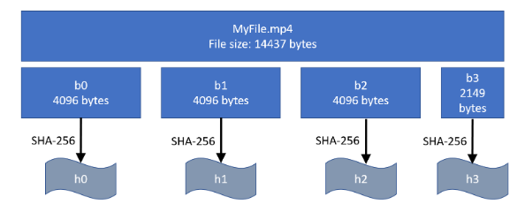

This is the info document for Project 4: Surfstore, a part of CSE 124 Networked Services, in compiling this user manual, I have included sections from the original assignment document for your privilege to better describe how this application works and its key integral components.
However if you are interested in just using it : [Usage instructions](#Usage)

SurfStore is a networked file storage application that is based on Dropbox, and lets you sync files to and from the “cloud”.I have implemented the cloud service and a demo client which interacts with the service via gRPC.
Multiple clients can concurrently connect to the SurfStore service to access a common, shared set of files. Clients accessing SurfStore “see” a consistent set of updates to files, but SurfStore does not offer any guarantees about operations across files, meaning that it does not support multi-file transactions (such as atomic move).

The SurfStore service is composed of the following two services:

**BlockStore** 

The content of each file in SurfStore is divided up into chunks, or blocks, each of which has a unique identifier. This service stores these blocks, and when given an identifier, retrieves and returns the appropriate block.

**MetaStore**

The MetaStore service manages the metadata of files and the entire system. Most importantly, the MetaStore service holds the mapping of filenames to blocks. Furthermore, it should be aware of available BlockStores and map blocks to particular BlockStores.  In a real deployment, a cloud file service like Dropbox or Google Drive will hold exabytes of data, and so will require 10s of thousands of BlockStores or more to hold all that data.


**Data Logistics**

In this section, we’ll go over some of the fundamentals of SurfStore: blocks, files, and versioning. 
Blocks, hashes, and hashlists
A file in SurfStore is broken into an ordered sequence of one or more blocks. Each block is of uniform size (defined by the command line argument), except for the last block in the file, which may be smaller (but must be at least 1 byte large). As an example, assume the block size is 4096 bytes, and consider the following file:



The file ‘MyFile.mp4’ is 14,437 bytes long, and the block size is 4KB. The file is broken into blocks b0, b1, b2, and b3 (which is only 2,149 bytes long). For each block, a hash value is generated using the SHA-256 hash function. So for MyFile.mp4, those hashes will be denoted as [h0, h1, h2, h3] in the same order as the blocks. This set of hash values, in order, represents the file, and is referred to as the hashlist. Note that if you are given a block, you can compute its hash by applying the SHA-256 hash function to the block. This also means that if you change data in a block the hash value will change as a result. To update a file, you change a subset of the bytes in the file, and recompute the hashlist. Depending on the modification, at least one, but perhaps all, of the hash values in the hashlist will change.

**Indexes**

The client program will create and maintain an index.txt file in the base directory which holds local, client-specific information that must be kept between invocations of the client. If that file doesn’t exist, the client should create it. In particular, the index.txt contains a copy of the server’s FileInfoMap accurate as of the last time that sync was called. The purpose of this index file is to detect files that have changed, or been added to the base directory since the last time that the client executed.


# Basic Operating theory

When a client syncs its local base directory with the cloud, a number of things must be done to properly complete the sync operation.
The client should first scan the base directory, and for each file, compute that file’s hash list. The client will then consult the local index file and compare the results, to see whether (1) there are now new files in the base directory that aren’t in the index file, or (2) files that are in the index file, but have changed since the last time the client was executed (i.e., the hash list is different).
Next, the client should connect to the server and download an updated FileInfoMap. For the purposes of this discussion, let’s call this the “remote index.”
The client should now compare the local index (and any changes to local files not reflected in the local index) with the remote index. A few things might result.
First, it is possible that the remote index refers to a file not present in the local index or in the base directory. In this case, the client should download the blocks associated with that file, reconstitute that file in the base directory, and then add the updated FileInfo information to the local index.
Next, it is possible that there are new files in the local base directory that aren’t in the local index or in the remote index. The client should upload the blocks corresponding to this file to the server, then update the server with the new FileInfo. If that update is successful, then the client should update its local index. Note it is possible that while this operation is in progress, some other client makes it to the server first, and creates the file first. In that case, the UpdateFile() operation will fail with a version error, and the client should handle this conflict as described in the next section.

# Usage

**Client**

For this project, clients will sync the contents of a “base directory” by:


The block size is specified as a command line option and you should use that instead of a hard-coded number.  Note that while your system must support different-sized blocks (specified on the command line), the size of the block will remain constant during any particular series of tests.  So we might run a set of tests with a block size of 4096, then clear everything and run a totally different set of tests in a new environment with a block size of 1 megabyte (for example).

**Server**

As mentioned earlier, Surfstore is composed of two services: MetaStore and BlockStore. In this project, the location of the MetaStore and BlockStore shouldn’t matter. In other words, the MetaStore and BlockStore could be serviced by a single server process, separate server processes on the same host, or separate server processes on different hosts. Regardless of where these services reside, the functionality should be the same.
Starting a Server  


**Single Server Process**

When iteratively developing your implementation of Surfstore, it’ll be beneficial to have an easy way to start both a MetaStore and BlockStore. This can be done with service_type = both. Internally, this should register both the MetaStore interface and BlockStore interface to the grpcServer.


**Separate Server Processes**

For other scenarios where you might want to test having separate MetaStores and BlockStores, you can use the other two service types. Below, I’ve given examples for starting separate MetaStores and BlockStores locally, but you can just as easily do the same with different hosts e.g. maybe having the MetaStore on local and the BlockStore on an AWS instance. 


## Examples:
```shell
go run cmd/SurfstoreServerExec/main.go -s both -p 8081 -l localhost:8081
```
This starts a server that listens only to localhost on port 8081 and services both the BlockStore and MetaStore interface.

```shell
Run the commands below on separate terminals (or nodes)
> go run cmd/SurfstoreServerExec/main.go -s block -p 8081 -l
> go run cmd/SurfstoreServerExec/main.go -s meta -l localhost:8081
```
The first line starts a server that services only the BlockStore interface and listens only to localhost on port 8081. The second line starts a server that services only the MetaStore interface, listens only to localhost on port 8080, and references the BlockStore we created as the underlying BlockStore. (Note: if these are on separate nodes, then you should use the public ip address and remove `-l`)

3. From a new terminal (or a new node), run the client using the script provided in the starter code (if using a new node, build using step 1 first). Use a base directory with some files in it.
```shell
> mkdir dataA
> cp ~/pic.jpg dataA/ 
> go run cmd/SurfstoreClientExec/main.go server_addr:port dataA 4096
```
This would sync pic.jpg to the server hosted on `server_addr:port`, using `dataA` as the base directory, with a block size of 4096 bytes.

4. From another terminal (or a new node), run the client to sync with the server. (if using a new node, build using step 1 first)
```shell
> mkdir dataB
> go run cmd/SurfstoreClientExec/main.go server_addr:port dataB 4096
> ls dataB/
pic.jpg index.txt
```
We observe that pic.jpg has been synced to this client.

## Makefile
We also provide a make file for you to run the BlockStore and MetaStore servers.
1. Run both BlockStore and MetaStore servers (**listens to localhost on port 8081**):
```shell
make run-both
```

2. Run BlockStore server (**listens to localhost on port 8081**):
```shell
make run-blockstore
```

3. Run MetaStore server (**listens to localhost on port 8080**):
```shell
make run-metastore
```

